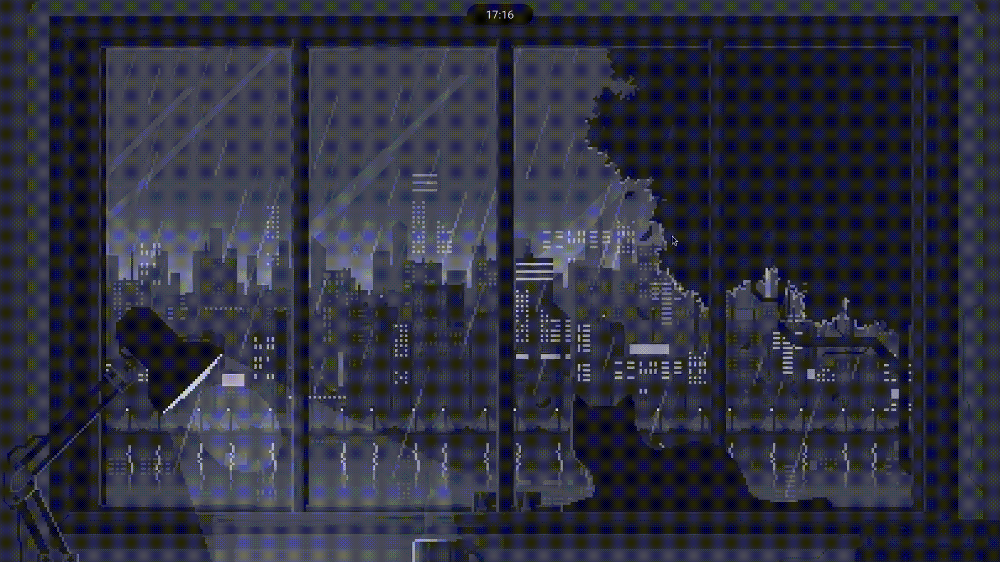

# Quickbar

Quickbar is a minimal, Material 3 Expressive–themed status bar for Linux, written in [Quickshell](https://quickshell.org/).

## Showcase

## Features
- Clock & date display
- [Hyprland](https://hyprland.org/) workspaces integration
- Wi-Fi & VPN controls
- Audio & brightness settings
- Battery indicator

## Theming
The entire bar follows Google's [Material 3 Expressive](https://m3.material.io/) design language. Colors can be defined manually in `Colors.qml`, or generated automatically from the current desktop wallpaper using [matugen](https://github.com/InioX/matugen).
